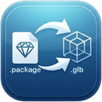

<div align="center">



# sims-package2glb

**Ouvrez les mods `.package` des Sims 2, 3 et 4 et recuperez du vrai glTF.**

Maillage, UV, normales, carte de normales et texture, embarques dans un seul
`.glb`. Ni Blender, ni Python, ni Sims 4 Studio. Une fenetre, un glisser-deposer.

[](LICENSE)
[](#installation)
[](https://tauri.app)

[English](README.md) · **Français**

</div>

---

## Ce que fait l'outil

Un fichier `.package` est un conteneur. A l'interieur se trouvent le modele, ses
niveaux de detail, ses materiaux et tous les coloris livres par le createur,
dans des formats qu'Electronic Arts n'a jamais documentes. Les outils existants
demandent soit une suite de moddage complete, soit vous rendent un tas de
ressources brutes en vous souhaitant bonne chance.

Celui-ci lit ces formats directement et ecrit un glTF binaire standard, que
Blender, Godot, Unreal, Unity, Three.js ou n'importe quel visualiseur glTF
ouvre sans extension.

| | |
|---|---|
| **Deposez ce que vous voulez** | Un fichier, une selection, ou un dossier entier. |
| **Voyez tout de suite** | Visualiseur Three.js integre, orbite, fil de fer, grille. |
| **Choisissez le coloris** | Les mods livrent plusieurs variantes. Chacune est proposee en vignette, et l'apercu se met a jour au clic. |
| **Exportez en lot** | Un dossier par objet. Au choix, les ressources brutes aussi : textures en `.dds` lisible et `.png`, ressources 3D d'origine. |
| **Trois jeux** | Les Sims 4, Les Sims 3 et Les Sims 2, detectes automatiquement. |
| **Anglais ou francais** | Bascule dans le coin, memorisee d'une session a l'autre. |

## Installation

Recuperez la derniere version sur la [page des releases](../../releases) :

- `sims-package2glb_x.y.z_x64-setup.exe` pour l'installeur,
- `sims-package2glb.exe` pour un fichier portable unique.

Windows uniquement pour l'instant. L'application entiere tient dans un
executable de 4,5 Mo, sans aucun environnement d'execution a installer.

## Utilisation

**Deposez-les sur l'executable** et ils sont convertis la ou ils se trouvent :
un dossier par objet a cote du package, ressources brutes comprises, sans
ouvrir de fenetre. Cela marche aussi depuis un terminal, qui rend compte :

```bash
sims-package2glb.exe "C:\Mods\mon objet.package"
sims-package2glb.exe "C:\Mods"
```

Ou ouvrez la fenetre pour le visualiseur et le selecteur de coloris :

1. Glissez des `.package`, ou un dossier qui en contient, sur la fenetre.
2. Cliquez sur une entree de la liste pour la regarder.
3. Choisissez un coloris dans la bande du bas.
4. Choisissez un dossier de sortie et appuyez sur **Exporter**.

Chaque objet arrive dans son propre dossier sous la forme `<nom>.glb`. Cochez
*Extraire aussi les ressources brutes* pour obtenir, a cote :

```
<nom>/
  <nom>.glb
  1_Textures/    chaque texture en .dds lisible et un apercu .png
  2_Assets_3D/   ressources MODL / MLOD d'origine
  3_Donnees/     definitions d'objet, textes, tuning
```

## Compiler depuis les sources

Necessite [Rust](https://rustup.rs) et [Node](https://nodejs.org).

```bash
npm install
npm run tauri dev      # fenetre de developpement
npm run tauri build    # executable et installeur NSIS
```

## Organisation

Le cote Rust porte toutes les decisions de format. L'interface se contente de
demander une lecture, un apercu ou un export, et de mettre en forme les
reponses.

| fichier | role |
|---------|------|
| `src-tauri/src/dbpf.rs` | conteneur DBPF, decompression zlib et RefPack |
| `src-tauri/src/texture.rs` | `DST1`/`DST5` vers DXT, `cImageData` des Sims 2, decodage, cartes de normales |
| `src-tauri/src/rcol.rs` | conteneur RCOL, `MODL`/`MLOD`, geometrie et materiaux |
| `src-tauri/src/gmdc.rs` | conteneur de geometrie des Sims 2 |
| `src-tauri/src/glb.rs` | ecriture glTF 2.0 binaire |
| `src-tauri/src/extract.rs` | choix du niveau de detail, coloris, assemblage |
| `src/viewer.js` | scene Three.js |
| `src/main.js` | coquille applicative |
| `src/i18n.js` | formulations anglaises et francaises |

## Notes sur les formats

Voici ce qui fait la difference entre un modele correct et un tas de triangles
convaincant. Rien de tout cela ne se devine, et tout a ete mesure sur de vrais
packages plutot que suppose.

**Les textures Sims 4 ne sont pas du DXT5, quoi qu'en dise l'en-tete.** Le code
a quatre caracteres indique `DST5`. Electronic Arts garde les memes blocs DXT
mais repartit leurs champs par plans couvrant *toute la chaine de mips a la
fois*, points de couleur avant indices :

```
[ alpha a0/a1 : 2 o ][ couleur c0/c1 : 4 o ][ indices alpha : 6 o ][ indices couleur : 4 o ]
```

Decode comme du DXT5 ordinaire, cela ne donne que du bruit colore. `DST1` ne
garde que les deux plans de couleur. Le Sims 3 stocke du DXT normal et passe
tel quel.

**Les references de chunk RCOL sont relatives.** Une reference `0x1000000N`
designe le chunk situe `N` places *apres* celui qui la porte, et non le chunk
`N`. Mesure sur un corpus de packages : 110 references sur 110 tombent sur le
tag attendu en lecture relative, 77 sur 110 en lecture absolue.

**Les tampons de sommets et d'indices sont partages.** Plusieurs maillages
vivent couramment dans une meme paire de tampons, et chaque entree de maillage
porte les offsets et les nombres d'elements de sa propre tranche, aux octets 24
(sommets, en octets), 32 (indices, en elements), 40 (nombre de sommets) et 44
(nombre de triangles). Les ignorer donne le bon modele entoure d'une gerbe de
triangles parasites. Les tampons d'indices sont encodes en differences sur toute
leur longueur : il faut derouler la chaine entierement avant d'en decouper la
tranche.

**Les positions sont homogenes.** `p = (x, y, z) / w`, les quatre composantes
etant stockees en entiers 16 bits. Le Sims 4 ecrit toujours `w = 32767`, ce qui
fait croire qu'une division par une constante suffit, jusqu'a l'arrivee d'un
fichier Sims 3 : ce jeu fait varier le diviseur par sommet (32767, 16383, 10922)
pour placer la precision la ou le modele en a besoin.

**Un chunk `MODL` de version `0x03xx` (Sims 4) ou `0x01xx` (Sims 3) ne liste
aucun maillage.** C'est un descripteur de niveau de detail qui pointe vers un
chunk `MLOD` de la meme ressource. Seule la version `0x02xx` porte une liste de
maillages.

**Les cartes de normales ne stockent que deux canaux.** X dans l'alpha, Y dans
la partie couleur, ou R, G et B portent le meme signal et ou G est le plus
precis. Z est reconstruit. Le canal vert suit la convention DirectX et doit etre
inverse pour glTF : sur les textures a fort relief, les X et Y stockes ont la
*meme* relation de signe avec le gradient du diffus, signature du vert dirige
vers le bas. Les tangentes sont exportees en `TANGENT`, avec le sens deduit des
UV, pour que la carte soit lue dans le repere ou elle a ete peinte.

**Le materiau par defaut pointe souvent hors du package.** Un mod de recoloriage
garde le materiau du jeu de base comme materiau par defaut et livre ses propres
textures comme materiaux supplementaires. Suivre le seul defaut donne un objet
sans aucune texture. En Sims 3, la reference n'est pas resoluble depuis le
package : c'est la raison d'etre du selecteur de coloris.

**Les Sims 2 sont d'une tout autre forme.** Leur conteneur est la version 1 de
DBPF : index a place fixe et aucune marque de compression dans les entrees,
c'est une ressource `DIR` a part qui liste les cles compressees, et chaque
ressource compressee commence par sa propre longueur avant le flux RefPack.
Leur geometrie n'est pas du RCOL mais un `GMDC`, un tableau plat d'elements
types relies par des groupes de donnees et decoupes en sous-ensembles nommes
par des groupes d'indices. Les textures vivent dans des conteneurs
`cImageData` : un en-tete objet nommant l'image et ses dimensions, puis les
mipmaps du plus petit au plus grand, chacune precedee de sa taille. Le plus
grand mip est reemballe en DDS pour etre decode. Le maillage ne nomme pas sa
texture, la liaison est donc proposee a la main, comme en Sims 3.

## Contribuer

Les issues et les pull requests sont bienvenues, en particulier les packages qui
sortent mal. Joignez le `.package` si vous pouvez le partager, ou indiquez d'ou
il vient.

## Licence

[MIT](LICENSE). Cree par [infinition](https://github.com/infinition).

Outil independant et non officiel. Les Sims est une marque d'Electronic Arts
Inc. Ce projet n'est ni affilie, ni approuve, ni sponsorise par Electronic Arts
Inc., et ne distribue aucun contenu du jeu. Ce que vous extrayez reste soumis
aux conditions de son auteur.
